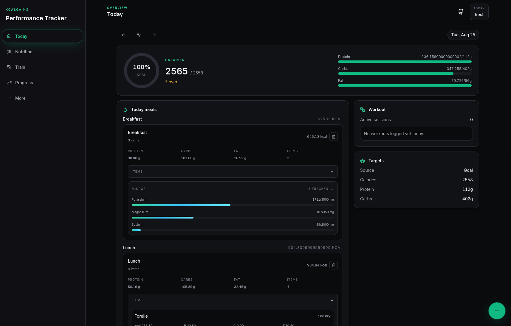

# KcalGains

[](https://kcalgains.pro-grammer.de/)

KcalGains is a local-first fitness and nutrition workspace for tracking meals, workouts, weight, and progress without needing a backend, account, or subscription.

It is designed to work as a Progressive Web App (PWA), so it can be installed on Android, iPhone, iPad, or desktop and used like a native app while keeping all data stored locally in the browser.



## Index **([Demo](https://kcalgains.pro-grammer.de/))**

- [Core features](#core-features)
- [App install guide](#app-install-guide)
  - [Android](#android)
  - [iPhone / iPad](#iphone--ipad)
  - [PC / desktop](#pc--desktop)
- [How data is stored](#how-data-is-stored)
- [Recommended workflow](#recommended-workflow)
- [Development](#development)
- [Project structure](#project-structure)

---

## Why this app exists

KcalGains helps you:

- track calories, protein, carbs, and fats
- monitor body metrics and weight trends
- log workouts and training sessions
- plan meals around a nutrition target
- build a personal food library
- keep everything private and offline-first
- back up data with a simple JSON export/import flow

This app is built for people who want a lightweight, personal dashboard without depending on a cloud service.

---

## Core features

### 1. Personal profile and goal tracking

- height, weight, birth year, and sex inputs
- activity level selection
- fitness goal setup such as fat loss, maintenance, muscle gain, or recomposition
- automatic daily target calculations based on profile + goal preferences
- dynamic target updates when profile data changes

### 2. Nutrition and body metrics

- BMI overview
- TDEE estimations
- weight logging and trend tracking
- daily macro target guidance
- visual charts for trends and meal breakdown

### 3. Meal logging and food data

- add and manage meals by date and meal type
- track calories and macros for each meal
- browse and search a local food library
- add custom foods manually
- search Open Food Facts data for nutrition info
- use barcode scanning to resolve foods faster

### 4. Workout logging

- track workout sessions by date and type
- log exercise details and duration
- save workout history for review
- use progress data to keep training habits visible

### 5. Meal balancing and planning

- build a meal from selected foods
- optimize ingredient combinations to reach macro targets
- adjust macro emphasis for calorie or protein accuracy
- generate a suggested meal plan based on your daily goals

### 6. AI-assisted import workflow

- generate a private prompt for AI tools like Gemini or ChatGPT
- paste a daily food log or meal list into the app
- validate and import AI-generated structured JSON data
- save imported nutrition records directly into the local database

This is useful for quickly converting written food logs into structured entries without manual re-entry.

### 7. Backup and restore

- export the entire local database as JSON
- import saved backups with merge or overwrite options
- drag-and-drop backup files into the app
- keep a portable copy of your stats and meal history

### 8. Offline-first experience

- all data stays in local IndexedDB storage
- app can be used without a network connection after it loads once
- installable as a web app on mobile and desktop
- works like a lightweight native app

### 9. Privacy and local-first design

- no user account required
- no server-side personal database
- backups are under your control
- your data remains in the browser unless you export it yourself

---

## Tech stack

- React + TypeScript
- Vite
- Tailwind CSS
- Dexie for IndexedDB persistence
- Recharts for trend visuals
- Vite PWA plugin for installability and offline support
- Zod for validation
- Open Food Facts integration for remote food lookup

---

## App install guide

### Android

To add KcalGains to your Android home screen as a PWA:

1. Open the app in Chrome.
2. Tap the menu button in the top-right corner.
3. Select Install app or Add to Home screen.
4. Confirm the prompt.
5. The app will appear on your home screen like a native app.

Once installed, you can open it directly, and it will keep working offline after the first load.

### iPhone / iPad

To install KcalGains on iOS as a PWA:

1. Open the app in Safari.
2. Tap the Share button at the bottom of the screen.
3. Scroll down and choose Add to Home Screen.
4. Tap Add in the top-right corner.
5. The app icon will be added to your home screen.

From there, you can launch it like a normal app, without needing the browser open.

### PC / desktop

On desktop browsers, you can also install the app through the browser menu:

- Chrome / Edge: install from the address bar or menu
- Firefox: use the page menu for site installation support

This creates a desktop shortcut or application window for the project.

---

## How data is stored

KcalGains uses the browser’s local storage layer via IndexedDB, through Dexie. That means:

- your data stays on your device
- the app is fast and lightweight
- you can export your data for backup or migration
- no external backend is required for core usage

---

## Recommended workflow

A typical daily flow:

1. Set up your profile and target goals
2. Log your current weight
3. Search or add foods you use
4. Log meals with calories and macros
5. Log workouts and training details
6. Review trends and macro balance
7. Use the meal planner or balancer when you need suggestions
8. Export a backup regularly for safety

---

## Development

Install dependencies with either package manager:

```bash
npm install
npm run dev
```

or:

```bash
pnpm install
pnpm dev
```

Then open:

```text
http://localhost:5173
```

### Run from another device on the same network

```bash
npm run dev:host
# or
pnpm dev:host
```

This exposes the app to your local network so you can test it from a phone or tablet.

> If you use pnpm and the install warns about an ignored esbuild step, run `pnpm install` once in the project root and retry the dev command.

### Automated regression checks

This project now includes a lightweight Vitest setup for the app’s highest-risk logic paths.

```bash
pnpm test
```

The current smoke suite covers:

- settings persistence and merge behavior
- dynamic target resolution with training context adjustments
- default configuration safety for the app settings schema

### Manual QA checklist

Use the app-level regression checklist in [QA_CHECKLIST.md](QA_CHECKLIST.md) before shipping a feature pass. It covers:

- onboarding persistence
- quick actions and add-entry flows
- meal log add/edit/remove actions
- workout and weight history edits
- training plan selection and duplicate prevention
- dynamic target updates across date and training mode changes

---

## Production build

```bash
npm run build
npm run preview
```

or:

```bash
pnpm build
pnpm preview
```

The production bundle is generated in the build output folder and can be served locally through the preview command.

---

## Privacy note

This app is intentionally local-first. It is not designed as a cloud sync service. If you want to keep a copy of your data, use the built-in backup export feature and save the JSON somewhere you control.

---

## Project structure

```text
src/
  App.tsx
  components/
    ai-bridge/
    analytics/
    balancer/
    dashboard/
    food/
    history/
    planner/
    pwa/
    settings/
    workout/
  db/
  hooks/
  services/
  schemas/
  types/
  utils/
```

---

## Notes for contributors

The project is intentionally focused on a single-user, privacy-first workflow. If you want to extend it, the easiest next improvements are:

- more advanced data filters and analytics
- printable weekly summaries
- recurring meal templates
- smarter AI parsing for food logs
- optional cloud sync behind a clear opt-in model
- more chart and progress customization

---

## License

This project is a local fitness tool and is currently intended for personal use. If you plan to publish or reuse it, confirm the licensing terms before distributing it beyond your own environment.

---

## Summary

KcalGains is a fully local, data-first nutrition and workout workspace built for tracking real progress without the friction of a cloud app. It is designed to feel fast, private, and reliable, and it can be installed like a native app on mobile devices as a PWA.
